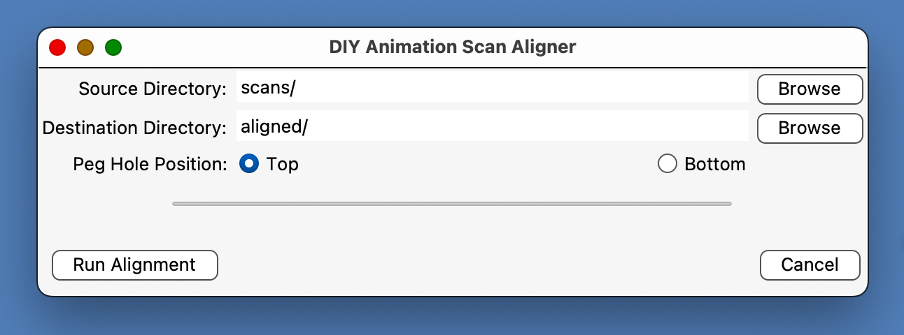

# DIY Animation Scan Aligner
DIY Animation Scan Aligner is an auto-alignment tool for animators who work on paper and use a standard 3-hole punch and pegbar with round pegs, rather than ACME. It is meant to address a gap in available tools for auto-alignment of scanned drawings on paper -- none of which were designed with standard 3-hole punch in mind. Brought to you by <a href="https://diyanimation.com">DIY Animation Club</a>.

## Assumptions
- This tool is optimized for a max resolution of 600 dpi, and assumes you are working on standard US Letter (8.5" × 11") paper
- It assumes _top_ as your pegbar position (Japan industry standard), but also supports bottom pegs (see Usage)
- It expects a numerically-named image sequence of scanned pages, placed into a subdirectory called **scans/**

## Features
- Auto-detects **3-hole punch pattern** (not ACME -- for that, you have the amazing <a href="https://www.olm.co.jp/post/olm-peg-hole-stabilizer-updated">OLM Peghole Stabilizer</a>)
- Auto-rotates pages that are upside-down or sideways
- Aligns pegholes across all pages, via translation and rotation (comparable to 2d image stabilization -- will not adjust scale)
- Outputs an aligned version of your scans as a PNG sequence to a subdirectory called **aligned/**
- The output folder will also include a log in `report.txt`, including any skipped pages (in case of errors)

### Command-line only features
- **Preview playback** mode shows you pages as they are processed (press ESC to quit)
- **Debug overlay** mode displays the detected peg hole location vs ideal peghole location

---

## Requirements

### GUI Version
- MacOS

### Command-line version (ignore if using GUi Version only)
- Python 3.8+
- OpenCV
- NumPy
- tqdm (progress bar)

Install dependencies with:

```bash
pip install -r requirements.txt

## Installation

Clone the repo and install dependencies:

```bash
git clone https://github.com/yourusername/diy-animation-scan-aligner.git
cd diy-animation-scan-aligner

# Create a virtual environment (recommended)
python3 -m venv venv
source venv/bin/activate   # On macOS/Linux
# .\venv\Scripts\activate  # On Windows

# Install required packages
pip install -r requirements.txt
```

Dependencies are:
- `opencv-python`
- `numpy`
- `tqdm`

---

## Usage

### GUI Usage (MacOS only)

1. Select a source directory that contains your scans.
2. Select a destination directory, where the output should be saved.
3. Select peg hole position (top or bottom). Prior to running alignment, the tool will run an orientation check, using this choice to determine which pages need to be rotated (90, 180, or 270 degrees) to correct orientation.
4. Click _Run Alignment_.

The tool will begin by duplicating the scans in your source directory and placing them into the destination directory (before alignment begins). Use the progress bar to determine batch completion, as the mere presence of files in the destination directory does not mean alignment has completed.

4. Browse to the destination directory to retrieve your aligned scans.

### Command-line Usage

Basic command:

```bash
python align_pages.py scans/ aligned/
```

This will:
- Examine all images in `scans/`
- Align all images to a single, shared "ideal" peghole location
- Write aligned PNGs to `aligned/`
- Write a `report.txt` log into `aligned/`

### Command-line Options

- `--holes-position top|bottom`  
  Default: `bottom`. Choose whether peg holes are at the top or bottom of the page.  

- `--debug`  
  Instead of clean aligned frames, output aligned frames with **debug overlays** showing:  
  - 🔵 detected holes  
  - 🔴 ideal/reference holes  
  - 🟢 transformed holes  

- `--preview`  
  Show aligned pages sequentially in a window. Press **ESC** to quit.  

- `--preview-delay <ms>`  
  Set time in milliseconds between preview frames (default: 500 aka .5 seconds).

### Example

```bash
python align_pages.py scans/ aligned/ --holes-position bottom --debug --preview --preview-delay 250
```

---

## Output
- `aligned/` folder with PNGs
- `aligned/report.txt` containing success/error logs for each frame

Example log entry:
```
frame001.png: success, detected=[[123.0, 456.0], [300.0, 455.0], [480.0, 457.0]]
frame002.png: ERROR - Failed to detect three holes on the page
```

---

## Notes
- This tool is designed for animation on **3-hole punched paper** only (it does _not_ support ACME).
- Input scans should include **all peg holes clearly visible**.
- Minor cropping at page edges is expected if original scans are skewed.
- Works best with **high-contrast scans** (peg holes clearly darker than paper).
- Using a production or feed scanner, you should end up with solid black pegholes
- Using a combo printer/scanner with ADF, you may need to add a strip of black electrical tape to the inside lid of your scanner bed, positioned so it sits directly behind the pegholes during the scanning process.
- Using a flatbed scanner, you may need to place a strip of black paper behind your pegholes to ensure that they end up looking solid black. Keep in mind that this tool is meant to save you time by unlocking batch scanning as an option. If you're already scanning one page at a time, you might as well just use a pegbar.

---

## License
GNU General Public License v3.0

## Roadmap
For now, this tool has only been tested and shown to work with _blank_, 3-hole punched pages. The next step is to get feedback from beta testers using scans of 3-hole-punches pages with fully animated linework, and see what bugs pop up. In the interest of shipping a working version, the GUI version for MacOS version does not support the preview and debug features of the command-line tool.
